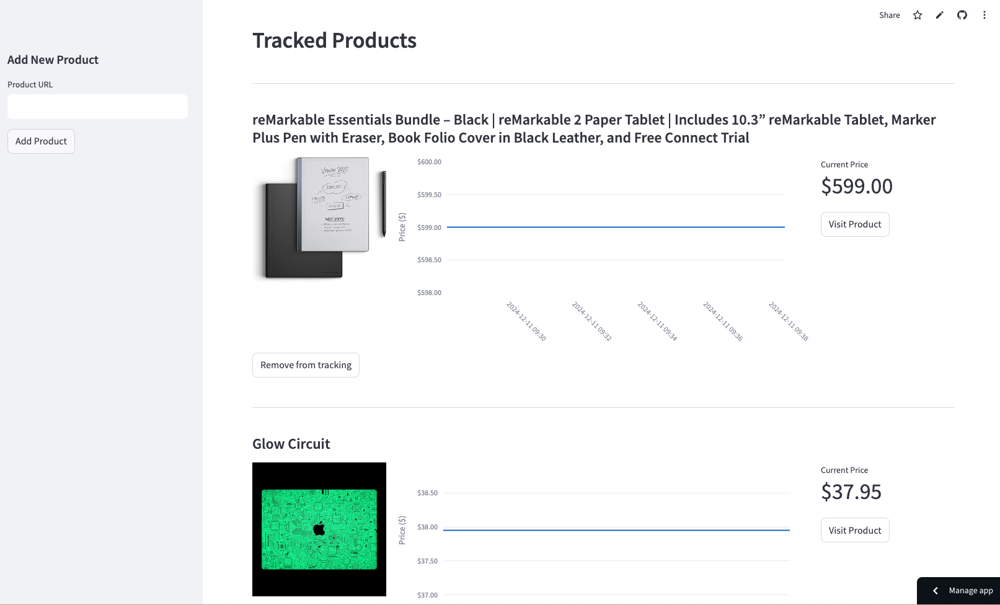

# Automated Price Tracking

A powerful web application that helps you track product prices across various e-commerce websites. Get notified via Discord when prices drop below your desired threshold! Perfect for deal hunters, online shoppers, and anyone looking to save money on their favorite products.



See the products I am tracking via [this Streamlit app](https://automated-price-tracker.streamlit.app/).

## Features

- 🔍 Track prices from multiple e-commerce websites simultaneously
- 📊 Visual price history tracking with interactive charts showing price trends over time
- 🔔 Customizable Discord notifications when prices drop below your target
- 🚀 Intuitive web interface built with Streamlit for easy product management
- 📈 Comprehensive historical price data storage and analysis
- ⚡ Automated price checking with configurable intervals (hourly/daily/weekly)
- 🔒 Secure data storage with PostgreSQL

## Tech Stack

- Python 3.10+ for robust backend functionality
- Streamlit for creating an interactive web interface
- PostgreSQL/SQLite for reliable data storage and retrieval
- SQLAlchemy ORM for efficient database operations
- Plotly for dynamic and interactive price history charts
- Discord Webhooks for real-time price drop notifications
- GitHub Actions for automated and scheduled price checking
- Poetry for dependency management
- Docker support for containerized deployment
- pytest for comprehensive testing

## Prerequisites

Before you begin, ensure you have:

- Python 3.10 or higher installed on your system
- Poetry package manager for dependency management
- A Discord webhook URL for receiving notifications (instructions below)
- A Firecrawl API key for reliable web scraping (sign up at firecrawl.com)
- PostgreSQL instance created online, preferably with Supabase (optional, SQLite works out of the box)
- Basic knowledge of command line operations

## Installation

1. Clone the repository:

```bash
git clone https://github.com/BexTuychiev/automated-price-tracking.git
cd automated-price-tracking
```

2. Install Poetry (if not already installed):

```bash
curl -sSL https://install.python-poetry.org | python3 -
```

3. Install dependencies:

```bash
poetry install
```

4. Create a `.env` file in the project root with the following variables:

```bash
FIRECRAWL_API_KEY=your_firecrawl_api_key
DISCORD_WEBHOOK_URL=your_discord_webhook_url
PRICE_DROP_THRESHOLD=0.05  # Change this to control notifications
POSTGRES_URL=your_postgres_url # Optional, SQLite used by default
```

> Note: You can sign up for a free Firecrawl account and get an API key [here](https://firecrawl.dev).

The app sends notifications to your private Discord server via a webhook if any of the tracked items' price drops below the `PRICE_DROP_THRESHOLD`. Instructions on how to get a Discord webhook URL are below.

Optionally, you can set up a [free Supabase Postgres instance](supabase.com) for free. I highly recommend this step because the local SQLite database will be wiped if you deploy the app to cloud platforms like Streamlit Cloud or Heroku.

## Usage

1. Start the application:

```bash
poetry run streamlit run streamlit_app.py
```

2. Add products to track:
   - Paste a product URL in the sidebar
   - Click "Add Product" to start tracking
   - The application will fetch initial price data

3. Monitor prices:
   - View price history charts for each product
   - Receive Discord notifications when prices drop
   - Remove products from tracking when needed

4. Automated price checking:
   - Prices are checked automatically every 6 hours via GitHub Actions
   - Manual checks can be triggered from the Actions tab

## Discord Webhook Setup

1. Open your Discord server settings
2. Navigate to "Integrations" → "Webhooks"
3. Click "New Webhook"
4. Name your webhook (e.g., "Price Alerts")
5. Copy the webhook URL
6. Add the URL to your `.env` file

## Online deployment

The app can be deployed to Streamlit Cloud for free:

1. Fork this repository
2. Sign up for [Streamlit Cloud](https://streamlit.io/cloud)
3. Create a new app and select your forked repository
4. Add the following secrets in the app settings:
   - `FIRECRAWL_API_KEY`
   - `DISCORD_WEBHOOK_URL`
   - `PRICE_DROP_THRESHOLD`
   - `POSTGRES_URL` (recommended)
5. Deploy the app

The GitHub Actions workflow will continue to run price checks automatically in your forked repository. Make sure to add the required secrets to your repository's settings as well (Settings → Secrets and variables → Actions).

## Development

### Project Structure

```bash
automated-price-tracking/
├── src/
│ ├── domain/ # Domain models and business logic
│ ├── infrastructure/ # Database and external services
│ ├── presentation/ # UI components and views
│ ├── services/ # Business services
│ └── tests/ # Test suites
├── data/ # Local SQLite database
└── streamlit_app.py # Application entry poin
```

### Running tests

```bash
poetry run pytest
```

### Adding New Features

1. Create a new branch:

```bash
git checkout -b feature/your-feature-name
```

2. Make your changes
3. Add tests
4. Run the test suite
5. Submit a pull request

## Contributing

1. Fork the repository
2. Create your feature branch
3. Commit your changes
4. Push to the branch
5. Create a Pull Request

## License

This project is licensed under the Apache License 2.0 - see the LICENSE file for details.

## Acknowledgments

- Built with [Streamlit](https://streamlit.io/)
- Price tracking powered by [Firecrawl](https://firecrawl.dev)
- Notifications via Discord Webhooks
- Deployment automation with GitHub Actions
